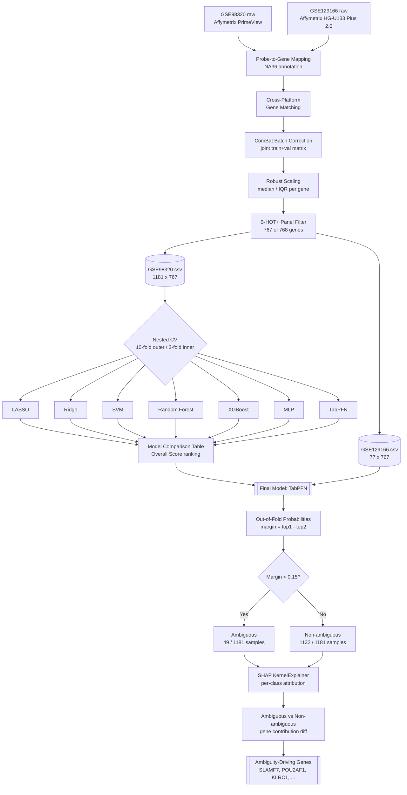
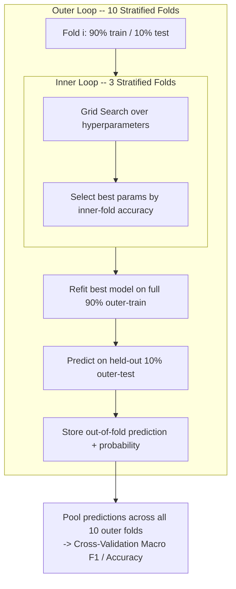
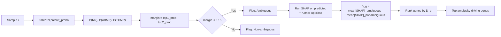

# TRACER: Transcriptomic Rejection Analysis and Classification with Explainable Reasoning

TRACER reproduces and extends the **B-HOT+** kidney transplant rejection
classifier originally described by van Baardwijk et al. (2022, *Frontiers in
Immunology*), which used a random forest model trained on the
Banff-Human Organ Transplant (B-HOT) gene panel plus six additional genes to
classify kidney transplant biopsies into **Non-Rejection (NR)**,
**Antibody-Mediated Rejection (ABMR)**, and **T-Cell-Mediated Rejection
(TCMR)**.

This project (1) faithfully reproduces the original data pipeline using the
authors' own preprocessing code and annotation files, (2) extends the
original single-model design by comparing seven machine learning algorithms
under an identical evaluation protocol, and (3) adds an uncertainty
quantification and SHAP-based explainability layer that identifies which
predictions are unreliable and which genes are responsible for that
unreliability — analysis not present in the original study.

---

## Background

- **Original paper:** van Baardwijk, M., Cristoferi, I., Ju, J., Varol, H.,
  Minnee, R. C., Reinders, M. E. J., Li, Y., Stubbs, A. P., & Clahsen-van
  Groningen, M. C. (2022). *A Decentralized Kidney Transplant Biopsy
  Classifier for Transplant Rejection Developed Using Genes of the
  Banff-Human Organ Transplant Panel.* Frontiers in Immunology, 13, 841519.
  [https://doi.org/10.3389/fimmu.2022.841519](https://doi.org/10.3389/fimmu.2022.841519)
- **Original repository:**
  [ErasmusMC-Bioinformatics/KidneyRejectionClassifier](https://github.com/ErasmusMC-Bioinformatics/KidneyRejectionClassifier)
  — we reused the authors' own annotation files and preprocessing functions
  directly for the reproduction stage.

---

## Repository Structure

```
kidney-transplant-biopsy-ml/
│
├── data/
│   ├── raw/
│   │   ├── GSE98320/                  # Training cohort (Affymetrix PrimeView)
│   │   └── GSE129166/                 # Validation cohort (Affymetrix HG-U133 Plus 2.0)
│   │
│   ├── processed/
│   │   ├── GSE98320.csv               # Final training set: 1181 samples x 767 B-HOT+ genes
│   │   ├── GSE129166.csv              # Final validation set: 77 samples x 767 B-HOT+ genes
│   │   └── common_genes.csv
│   │
│   └── features/
│       └── BHOT_plus_entrez_mapping.csv   # B-HOT+ gene panel (from original repo)
│
├── notebooks/
│   ├── 01_data_pipeline_BHOT_plus.ipynb   # Download, label, map, ComBat, scale, filter
│   └── 05_model_comparison.py             # Orchestrates the 7-model nested CV comparison
│
├── src/
│   ├── utils/
│   │   └── data_utils.py              # load_dataset(), align_features()
│   ├── models/
│   │   ├── lasso.py
│   │   ├── ridge.py
│   │   ├── svm.py
│   │   ├── random_forest.py
│   │   ├── xgboost_model.py
│   │   ├── mlp.py
│   │   └── tabpfn_model.py
│   └── evaluation/
│       ├── metrics.py
│       └── nested_cv.py
│
├── results/
│   ├── cv/
│   │   ├── model_comparison_summary.csv
│   │   ├── model_comparison_detailed.csv
│   │   └── model_comparison_ranking.csv
│   ├── validation/
│   │   └── independent_validation.csv
│   ├── uncertainty/
│   │   └── tabpfn_uncertainty_results.csv
│   └── shap/
│       ├── shap_per_sample_ambiguous.csv
│       ├── shap_aggregate_ambiguity_ranking_named.csv
│       └── shap_ambiguous_vs_nonambiguous_comparison.csv
│
├── paper/
│   └── tracer.tex                     # Full write-up (IEEEtran format)
│
└── README.md
```

---

## Datasets

Two public Gene Expression Omnibus datasets, identical to the original
study:

| Dataset | Role | Platform | Samples (after filtering) |
|---|---|---|---|
| **GSE98320** | Training | Affymetrix PrimeView | 1,181 (774 NR, 326 ABMR, 81 TCMR) |
| **GSE129166** | External validation | Affymetrix HG-U133 Plus 2.0 | 77 (60 NR, 15 ABMR, 2 TCMR) |

Samples labeled *Mixed* or *Borderline* rejection were excluded, matching
the original study exactly.

---

## Preprocessing Pipeline

1. **Download** raw expression data and phenotype metadata from GEO.
2. **Diagnostic labeling** — archetype clusters (GSE98320) and
   histological ABMR/TCMR indicators (GSE129166, biopsy samples only).
3. **Probe-to-gene mapping** using the official Affymetrix NA36 annotation
   files and the original authors' own preprocessing functions.
4. **Cross-platform gene matching** between the two microarray platforms.
5. **ComBat batch correction**, applied jointly across the combined
   training + validation expression matrix, matching the original study's
   methodology (see [Limitations](#limitations)).
6. **Robust scaling** (median / IQR) per gene.
7. **B-HOT+ panel filtering** — 767 of the intended 768 genes were
   recovered after cross-platform harmonization.

---

## Model Comparison

Seven algorithms were compared under an identical **nested cross-validation**
protocol (stratified 10-fold outer / 3-fold inner, grid search for
hyperparameter selection): LASSO, Ridge, SVM, Random Forest, XGBoost, MLP,
and **TabPFN** (a pretrained transformer for tabular data).

| Model | CV Accuracy | CV Macro F1 | External Accuracy | External Macro F1 | Overall Score | Rank |
|---|---|---|---|---|---|---|
| **TabPFN** | 91.53 | 87.86 | 97.33 | 96.03 | **93.19** | **1** |
| Ridge | 91.02 | 88.14 | 94.67 | 92.39 | 91.56 | 2 |
| LASSO | 92.46 | 88.47 | 93.33 | 91.61 | 91.47 | 3 |
| SVM | 88.74 | 84.79 | 96.00 | 94.17 | 90.93 | 4 |
| XGBoost | 91.87 | 87.13 | 93.33 | 90.29 | 90.66 | 5 |
| Random Forest | 90.69 | 86.87 | 93.33 | 90.24 | 90.28 | 6 |
| MLP | 88.57 | 83.51 | 93.33 | 90.68 | 89.02 | 7 |

*Overall Score = mean of CV Accuracy, CV Macro F1, External Accuracy,
External Macro F1. External metrics exclude TCMR (only 2 samples in
GSE129166 — too few for stable evaluation, following the original study's
own reporting convention).*

**TabPFN** was selected as the final model — best overall score, and best
external validation performance, despite not having the single highest
cross-validation macro F1 (LASSO's CV macro F1 was marginally higher).
A tuned TabPFN configuration (larger ensemble, class-balanced probabilities,
F1-optimized thresholds) did not outperform the default configuration and
was not used.

---

## Uncertainty Quantification

Using TabPFN's out-of-fold predicted probabilities on GSE98320, we defined a
**prediction margin** (top-1 minus top-2 class probability) for every
sample. A threshold of **0.15** (selected by comparing 0.05–0.35) flags
49 of 1,181 samples (4.2%) as "ambiguous."

| Group | n | Accuracy | Macro F1 |
|---|---|---|---|
| Full dataset | 1,181 | 91.53% | 0.8786 |
| Non-ambiguous | 1,132 | 93.37% | 0.9038 |
| **Ambiguous** | **49** | **48.98%** | **0.4185** |

The near two-fold accuracy gap between ambiguous and non-ambiguous samples
shows the margin is a genuinely useful, actionable signal for flagging
unreliable predictions.

Applying the same locked threshold to GSE129166 flagged only 1 of 75
samples — too few to draw a statistical conclusion; this external check is
reported as **inconclusive**, not as a success or failure.

---

## SHAP-Based Explainability

SHAP (kernel-based, model-agnostic) was applied to the 49 ambiguous samples,
comparing each gene's contribution there against its contribution across
all 1,132 non-ambiguous samples. The genes most *specifically* associated
with ambiguity (not just generally important) cluster into two coherent
biological themes:

- **Humoral / plasma-cell signature:** `SLAMF7`, `POU2AF1`, `CD27`, `CCR10`
- **NK-cell / cytotoxic signature:** `KLRC1`, `IL2RB`

Notably, `KLRC1` belongs to the same gene family as `KLRC4-KLRK1`, one of
the six genes the original authors added to the B-HOT panel — an
independent convergence found via an uncertainty-focused analysis rather
than accuracy-focused feature selection.

**Note on interpretation:** SHAP itself only attributes per-sample,
per-class model output to input features — it has no built-in notion of
"ambiguity." The ambiguity-specific gene ranking is a derived statistic
(mean SHAP contribution in the ambiguous group minus the non-ambiguous
group), not something SHAP computes directly. These are genes whose
influence is *disproportionately concentrated* in hard-to-classify cases,
not genes proven to *cause* ambiguity.

---

## Pipeline Architecture



---

## Nested Cross-Validation Structure



---

## Uncertainty + SHAP Decision Flow



---

## Data Schemas

### `data/processed/GSE98320.csv` / `GSE129166.csv`

| Column | Type | Description |
|---|---|---|
| `sample_id` | string | GEO sample accession (e.g. `GSM2590943`) |
| `diagnosis` | categorical | `NR` \| `ABMR` \| `TCMR` |
| `<entrez_id>` × 767 | float | Robust-scaled expression value per B-HOT+ gene |

### `results/uncertainty/tabpfn_uncertainty_results.csv`

| Column | Type | Description |
|---|---|---|
| `sample_id` | string | Sample accession |
| `y_true`, `y_pred` | categorical | Ground truth / predicted class |
| `P_ABMR`, `P_NR`, `P_TCMR` | float | Out-of-fold predicted probabilities |
| `top_prob`, `second_prob` | float | Highest / second-highest class probability |
| `margin` | float | `top_prob - second_prob` |
| `correct` | bool | `y_true == y_pred` |
| `Ambiguous` | categorical | `Ambiguous` \| `Non-ambiguous` (threshold = 0.15) |

### `results/shap/shap_ambiguous_vs_nonambiguous_comparison.csv`

| Column | Type | Description |
|---|---|---|
| `gene_entrez_id` | string | Entrez gene ID |
| `gene_symbol` | string | Gene symbol (joined via `BHOT_plus_entrez_mapping.csv`) |
| `ambiguous_rank_score` | float | Mean \|SHAP\| contribution, ambiguous group (n=49) |
| `nonambiguous_rank_score` | float | Mean \|SHAP\| contribution, non-ambiguous group (n=1132) |
| `ambiguity_specific` | float | `ambiguous_rank_score - nonambiguous_rank_score` |

---

## Limitations

- **Joint batch correction:** ComBat was applied jointly across the
  combined training + validation matrix, matching the original study's
  methodology. This means GSE129166 is not a fully independent, leakage-free
  held-out test set in the strict ML sense — results should be read as
  reproducing the original study's validation protocol.
- **Small external TCMR cohort:** only 2 TCMR samples in GSE129166; TCMR is
  excluded from external validation and uncertainty reporting on that set.
- **Model-specific explainability:** the SHAP analysis characterizes
  TabPFN's decision behavior specifically and should not be assumed to
  generalize to the other six compared models.
- **Inconclusive external uncertainty check:** only 1 sample was flagged
  ambiguous on GSE129166, too few to statistically validate the margin
  threshold externally.
- **No significance testing (yet) on SHAP ambiguity scores:** the
  ambiguous-vs-non-ambiguous gene ranking is currently descriptive; a
  permutation test would be needed to establish statistical significance
  per gene.

---

## Reproducing This Work

All steps were run in Google Colab.

1. **Data pipeline** (`notebooks/01_data_pipeline_BHOT_plus.ipynb`, R
   runtime): download GSE98320/GSE129166, label, preprocess, and produce
   `data/processed/GSE98320.csv` and `GSE129166.csv`.
2. **Model comparison** (`notebooks/05_model_comparison.py`, Python
   runtime): trains and nested-cross-validates all seven models, saves
   comparison tables to `results/cv/`.
3. **Uncertainty quantification:** computes out-of-fold margins for TabPFN,
   sweeps candidate thresholds, locks the final threshold, saves to
   `results/uncertainty/`.
4. **SHAP explainability:** runs on the ambiguous (and, for comparison, all
   non-ambiguous) samples, saves per-sample and aggregate rankings to
   `results/shap/`.

Install dependencies per stage:
```bash
pip install xgboost tabpfn shap openpyxl
```

---

## Citation

```bibtex
@article{vanbaardwijk2022decentralized,
  title={A Decentralized Kidney Transplant Biopsy Classifier for Transplant
         Rejection Developed Using Genes of the Banff-Human Organ Transplant Panel},
  author={van Baardwijk, Myrthe and Cristoferi, Iacopo and Ju, Jie and
          Varol, Hilal and Minnee, Robert C and Reinders, Marlies E J and
          Li, Yunlei and Stubbs, Andrew P and Clahsen-van Groningen, Marian C},
  journal={Frontiers in Immunology},
  volume={13},
  pages={841519},
  year={2022},
  publisher={Frontiers}
}
```
