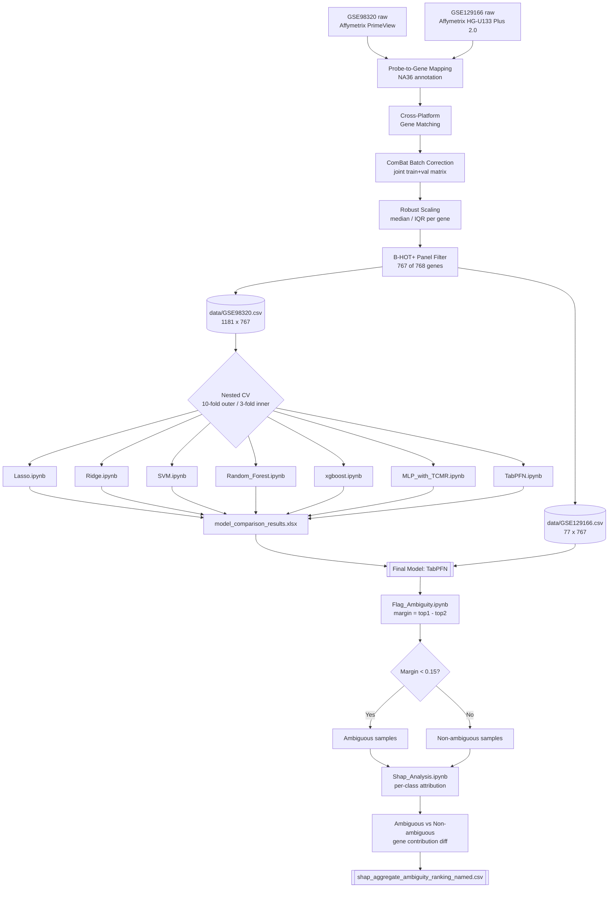
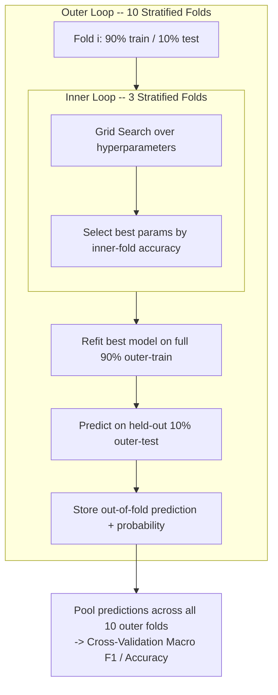
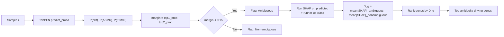

# TRACER: Transcriptomic Rejection Analysis and Classification with Explainable Reasoning

TRACER extends a B-HOT+ gene-panel-based kidney transplant
rejection classifier, originally built on a single random forest model, into
a full comparison of algorithms with an added
uncertainty quantification and SHAP-based explainability layer.

The classifier distinguishes between three biopsy categories:

- **NR** — Non-Rejection
- **ABMR** — Antibody-Mediated Rejection
- **TCMR** — T-Cell-Mediated Rejection

---

## Repository Structure

```
TRACER/
├── README.md
├── Flag_Ambiguity.ipynb              # Margin-threshold sweep and selection
├── Ambiguity rate vs Threshold.png
├── Error rate.png
├── Error-capture rate vs threshold.png
│
├── data/
│   ├── GSE98320.csv                  # Training set: 1181 samples x 767 B-HOT+ genes
│   ├── GSE129166.csv                 # External validation set: 77 samples x 767 B-HOT+ genes
│   └── tabpfn_uncertainty_results.csv
│
├── models/
│   ├── Lasso.ipynb
│   ├── Ridge.ipynb
│   ├── SVM.ipynb
│   ├── Random_Forest.ipynb
│   ├── xgboost.ipynb
│   ├── MLP_with_TCMR.ipynb
│   ├── MLP_No_TCMR.ipynb
│   ├── TabPFN.ipynb
│   └── TabPFN_comparison.ipynb       # Default vs tuned TabPFN configuration
│
├── preprocessing/
│   ├── author/
│   │   └── preprocessing_original.R  # Original authors' preprocessing script
│   └── updated preprocessing/
│       └── data_preprocessing.r      # Author-faithful pipeline (NA36 annotation, ComBat, robust scaling)
│
├── results/
│   ├── TabPFN_tuning_comparison.png
│   ├── model_comparison_results.xlsx
│   ├── shap_ambiguity_top_genes.png
│   ├── shap_ambiguous_vs_nonambiguous_comparison.csv
│   └── tabpfn_uncertainty_results.csv
│
└── shap/
    ├── Shap_Analysis.ipynb
    ├── shap_aggregate_ambiguity_ranking.csv
    ├── shap_aggregate_ambiguity_ranking_named.csv
    ├── shap_ambiguity_top_genes.png
    ├── shap_ambiguous_vs_nonambiguous_comparison.csv
    └── shap_per_sample_ambiguous.csv
```

---

## Pipeline Architecture



---

## Nested Cross-Validation Structure



---

## Uncertainty + SHAP Decision Flow



---

## Datasets

| Dataset | Role | Platform | Samples (after filtering) |
|---|---|---|---|
| **GSE98320** | Training | Affymetrix PrimeView | 1,181 (774 NR, 326 ABMR, 81 TCMR) |
| **GSE129166** | External validation | Affymetrix HG-U133 Plus 2.0 | 77 (60 NR, 15 ABMR, 2 TCMR) |

Samples labeled *Mixed* or *Borderline* rejection were excluded.

---

## Preprocessing (`preprocessing/`)

1. **Download** raw expression data and phenotype metadata from GEO.
2. **Diagnostic labeling** — archetype clusters (GSE98320) and
   histological ABMR/TCMR indicators (GSE129166, biopsy samples only).
3. **Probe-to-gene mapping** using the official Affymetrix NA36 annotation
   files and the original authors' own preprocessing functions
   (`preprocessing/author/preprocessing_original.R`).
4. **Cross-platform gene matching** between the two microarray platforms.
5. **ComBat batch correction**, applied jointly across the combined
   training + validation expression matrix (`preprocessing/updated
   preprocessing/data_preprocessing.r`) 
6. **Robust scaling** (median / IQR) per gene.
7. **B-HOT+ panel filtering** — 767 of the intended 768 genes were
   recovered after cross-platform harmonization, producing
   `data/GSE98320.csv` and `data/GSE129166.csv`.

---

## Model Comparison (`models/`)

Seven algorithms were compared under an identical **nested cross-validation**
protocol (stratified 10-fold outer / 3-fold inner, grid search for
hyperparameter selection).

| Model | CV Accuracy | CV Macro F1 | External Accuracy | External Macro F1 | Overall Score | Rank |
|---|---|---|---|---|---|---|
| **TabPFN** | 91.53 | 87.86 | 97.33 | 96.03 | **93.19** | **1** |
| Ridge | 91.02 | 88.14 | 94.67 | 92.39 | 91.56 | 2 |
| Lasso | 92.46 | 88.47 | 93.33 | 91.61 | 91.47 | 3 |
| SVM | 88.74 | 84.79 | 96.00 | 94.17 | 90.93 | 4 |
| XGBoost | 91.87 | 87.13 | 93.33 | 90.29 | 90.66 | 5 |
| Random Forest | 90.69 | 86.87 | 93.33 | 90.24 | 90.28 | 6 |
| MLP | 88.57 | 83.51 | 93.33 | 90.68 | 89.02 | 7 |

*Overall Score = mean of CV Accuracy, CV Macro F1, External Accuracy,
External Macro F1. External metrics exclude TCMR (only 2 samples in
GSE129166). Full results in `results/model_comparison_results.xlsx`.*

**TabPFN** (`models/TabPFN.ipynb`) was selected as the final model — best
overall score and best external validation performance. A tuned
configuration was also tested (`models/TabPFN_comparison.ipynb`,
`results/TabPFN_tuning_comparison.png`) — larger ensemble, class-balanced
probabilities, F1-optimized thresholds — but did not outperform the default
configuration.

---

## Uncertainty Quantification (`Flag_Ambiguity.ipynb`)

Using TabPFN's out-of-fold predicted probabilities on GSE98320, a
**prediction margin** (top-1 minus top-2 class probability) was computed for
every sample. Candidate thresholds from 0.05 to 0.35 were compared
(`Ambiguity rate vs Threshold.png`, `Error rate.png`, `Error-capture rate vs
threshold.png`), and **0.15** was selected, flagging 49 of 1,181 samples
(4.2%) as ambiguous.

Applying the same locked threshold to GSE129166 flagged only 1 of 75
samples — too few to draw a statistical conclusion; this external check is
reported as **inconclusive**, not as a success or failure.

Full results: `data/tabpfn_uncertainty_results.csv`,
`results/tabpfn_uncertainty_results.csv`.

---

## SHAP-Based Explainability (`shap/`)

SHAP (kernel-based, model-agnostic — `shap/Shap_Analysis.ipynb`) was applied
to the samples flagged as ambiguous, comparing each gene's contribution
there against its contribution across the non-ambiguous samples. The genes
most *specifically* associated with ambiguity (not just generally
important — `shap/shap_ambiguous_vs_nonambiguous_comparison.csv`) cluster
into two coherent biological themes:

- **Humoral / plasma-cell signature:** `SLAMF7`, `POU2AF1`, `CD27`, `CCR10`
- **NK-cell / cytotoxic signature:** `KLRC1`, `IL2RB`

Notably, `KLRC1` belongs to the same gene family as `KLRC4-KLRK1`, one of
the six genes the original authors added to the B-HOT panel — an
independent convergence found via an uncertainty-focused analysis rather
than accuracy-focused feature selection.

**Note on interpretation:** SHAP itself only attributes per-sample,
per-class model output to input features — it has no built-in notion of
"ambiguity." The ambiguity-specific gene ranking
(`shap/shap_aggregate_ambiguity_ranking_named.csv`) is a derived statistic
(mean SHAP contribution in the ambiguous group minus the non-ambiguous
group), not something SHAP computes directly. These are genes whose
influence is *disproportionately concentrated* in hard-to-classify cases,
not genes proven to *cause* ambiguity.


---


## Citation

M. van Baardwijk, I. Cristoferi, J. Ju, H. Varol, R. C. Minnee, M. E. J.
Reinders, Y. Li, A. P. Stubbs, and M. C. Clahsen-van Groningen, "A
Decentralized Kidney Transplant Biopsy Classifier for Transplant Rejection
Developed Using Genes of the Banff-Human Organ Transplant Panel,"
*Frontiers in Immunology*, vol. 13, Art. no. 841519, 2022.
[https://doi.org/10.3389/fimmu.2022.841519](https://doi.org/10.3389/fimmu.2022.841519)
